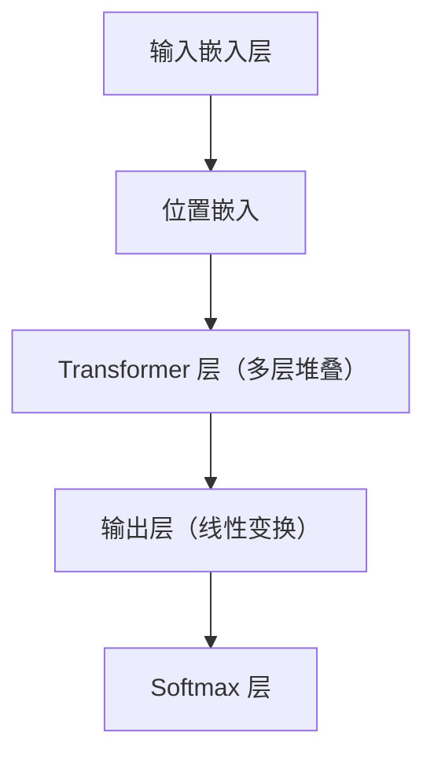
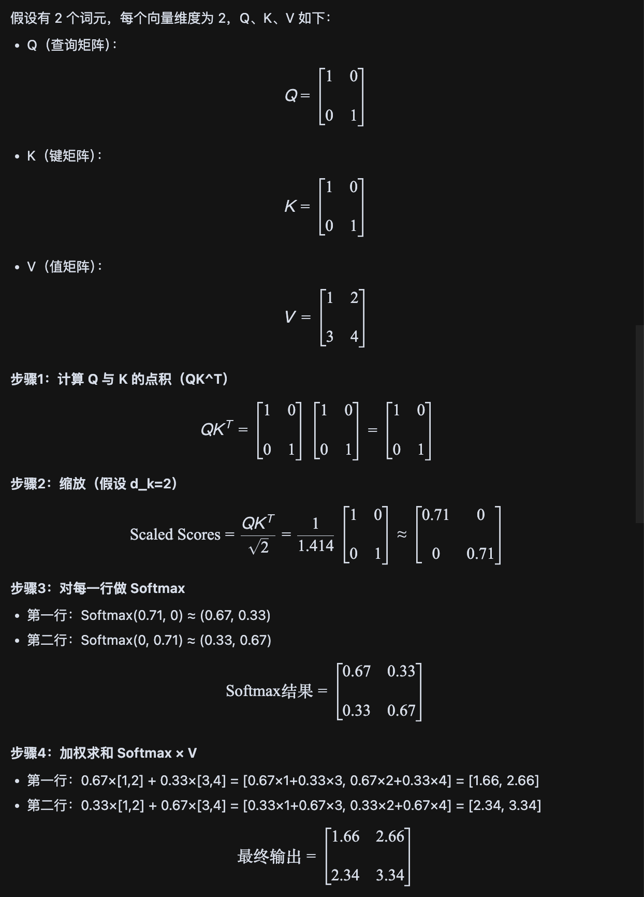
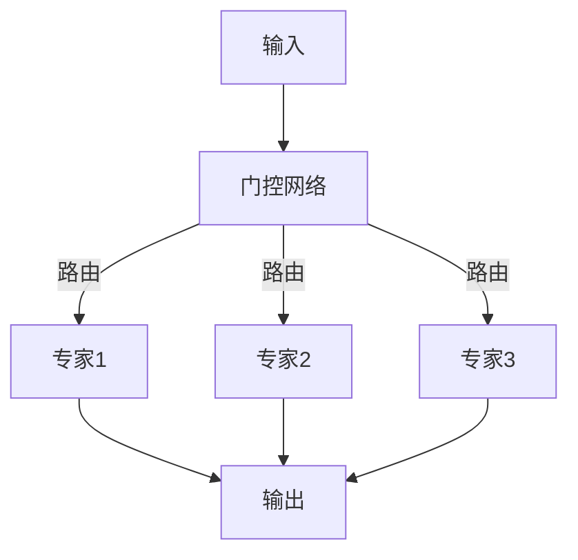

# 大型语言模型（LLMs）核心架构与原理

大型语言模型（LLMs）的核心功能是**预测序列中的下一个词元（token）**。本质上，这是一个数学函数：
- **输入**：词元序列
- **输出**：下一个词元的概率分布

## 1. 模型整体架构

### 主要组成部分

1. **输入嵌入层 (Input Embedding)**
   - 将词元（整数ID）转换为密集向量。
   - 加入位置信息（Position Embedding 或 RoPE）。
2. **Transformer 层 (Transformer Block)**
   - 多层堆叠。
   - 每层包含：
     - 注意力机制（Attention）
     - 前馈网络（Feed-Forward Network, FFN）
     - 层归一化（Layer Normalization, LN）
3. **输出层 (Output Layer)**
   - 将 Transformer 输出映射到词汇表大小（线性层），输出 logits。
4. **Softmax 层**
   - 将 logits 转换为概率分布。

---

## 2. Transformer 层细节

### 2.1 注意力机制 (Attention)

注意力机制的主要计算流程如下：

1. **输入**：获得每个token向量，进行线性变化，获取到 Q（查询）、K（键）、V（值）向量。
2. **点积**：对每个词元的 Q 与所有词元的 K 做点积，得到注意力分数。
3. **缩放**：将点积结果除以 \(\sqrt{d_k}\) 进行缩放，防止梯度消失。
4. **掩码**：在自回归模型中，对未来位置进行掩码处理，防止信息泄露。
5. **Softmax**：对每一行分数做 Softmax，得到每个词元对其他词元的注意力权重。
6. **加权求和**：用 Softmax 得到的权重对所有 V 向量加权求和，得到每个词元的输出。
7. **输出**：每个词元的输出向量作为后续层的输入。

#### 矩阵计算直观例子

**总结**：  
每个词元的输出是所有值向量的加权和，权重由 Softmax 后的注意力分数决定。这样，模型可以"关注"到序列中最相关的信息。

### 2.2 多头注意力 (Multi-Head Attention, MHA)
- 并行执行多组 QKV 投影，关注不同子空间信息
- 各头输出拼接后再线性变换

### 2.3 前馈网络 (Feed-Forward Network, FFN)
- 位置独立的多层感知机（MLP）
- 结构：线性层 → 激活函数（如 ReLU/GELU）→ 线性层
- DeepSeek-V3 在 FFN 采用 DeepSeekMoE 架构优化

### 2.4 层归一化 (Layer Normalization, LN) / RMSNorm
- 稳定网络训练
- DeepSeek-V3 采用 RMSNorm

---

## 3. 输出层与 Softmax
- Transformer 块输出 → 线性层（输出 logits）
- logits 通过 Softmax 转为概率分布
- 选择概率最高的词元或采样作为输出

---

## 4. 现代优化技术

### 4.1 MLA（多头潜在注意力，Multi-Head Latent Attention）
- DeepSeek-V3 采用 MLA
- 对查询低秩压缩，推理时对键和值进行 KV 缓存压缩
- 显著减少 KV 缓存大小，性能接近标准 MHA

### 4.2 MoE（专家混合，Mixture of Experts）
- DeepSeek-V3 在 FFN 使用 DeepSeekMoE
- 包含多个"专家"网络（小型 FFN），门控网络决定路由
- 只激活部分参数，提升模型容量和推理效率

---

## 5. 总结

通过理解 LLM 的基础架构（嵌入、Transformer 块、注意力、MHA、FFN、LN/RMSNorm、输出层、Softmax），你就能更好地学习 MLA 和 MoE 这些高级优化技术。
- MLA 优化注意力机制效率
- MoE 优化前馈网络结构和效率
